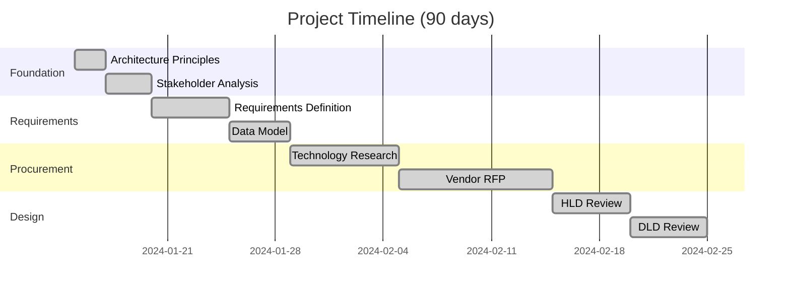
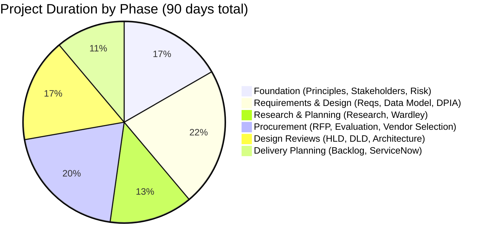
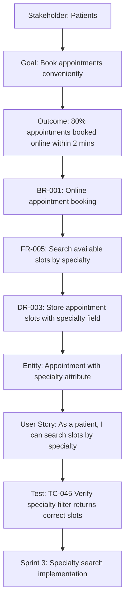

# Project Story Guide

A comprehensive guide to generating project stories with timeline analysis, traceability, and governance achievements using ArcKit.

---

## What is a Project Story?

A Project Story is a comprehensive narrative document that tells the complete journey of an ArcKit-managed project from inception to completion. It's not just a status report—it's a **historical record** with detailed timeline analysis, complete traceability chains, and demonstrated governance achievements.

### Why Project Stories Matter

Without a project story:
- ❌ **No Historical Record** - Lost knowledge when team members leave
- ❌ **Fragmented Artifacts** - Documents exist but connections unclear
- ❌ **Governance Invisible** - Compliance work not demonstrated
- ❌ **Lessons Lost** - No systematic capture of what worked/didn't work
- ❌ **Stakeholder Confusion** - No single source explaining project evolution

With a comprehensive project story:
- ✅ **Complete Traceability** - End-to-end chains from stakeholders to sprints
- ✅ **Timeline Transparency** - 4 visualizations showing project pacing
- ✅ **Governance Showcase** - Demonstrate TCoP, Service Standard, NCSC CAF compliance
- ✅ **Knowledge Retention** - Decisions rationale preserved for future teams
- ✅ **Lessons Learned** - Systematic analysis of timeline deviations and pacing
- ✅ **Portfolio Reporting** - Executive-ready summary of project achievements

---

## When to Generate a Project Story

Run `/arckit.story` at key milestones or project completion:

```
Phase 1-15: ALL ARCKIT COMMANDS    ← Build up project artifacts
Phase 16: /arckit.story            ← GENERATE STORY (START HERE)
```

**Ideal Times to Generate**:
- **Project Completion** - Comprehensive retrospective
- **Phase Gates** - Discovery → Alpha, Alpha → Beta, Beta → Live
- **Quarterly Reviews** - Portfolio progress reporting
- **Stakeholder Briefings** - Demonstrate governance achievements
- **Team Handovers** - Knowledge transfer to new team members

**CRITICAL**: You should have **at least 3-5 artifacts** for a meaningful story:
- Architecture principles (global)
- Stakeholder analysis
- Requirements OR Risk Register
- At least one design/procurement artifact

---

## Creating a Project Story with ArcKit

### Step 1: Ensure Prerequisites Exist

```bash
# MANDATORY - Story needs architecture principles
ls .arckit/memory/architecture-principles.md

# RECOMMENDED - Better stories with more artifacts
ls projects/NNN-project-name/stakeholder-drivers.md
ls projects/NNN-project-name/requirements.md
ls projects/NNN-project-name/risk-register.md
ls projects/NNN-project-name/sobc.md
```

### Step 2: Run Story Command

```bash
/arckit.story Generate story for [your project]
```

**Examples**:
```bash
/arckit.story Generate comprehensive project story for NHS appointment booking system

/arckit.story Create project story for payment modernization

/arckit.story Generate story for project 001

/arckit.story List all projects
# (then select project from list)
```

### Step 3: Review the Output

ArcKit creates `projects/NNN-project-name/PROJECT-STORY.md` containing:

1. **Executive Summary** - 2-3 paragraphs with key achievements
2. **Timeline Analysis** - 4 visualization types (Gantt, flowchart, table, pie chart)
3. **8 Narrative Chapters** - Foundation → Business Case → Requirements → Research → Procurement → Design → Delivery → Compliance
4. **Traceability Demonstration** - End-to-end chains with Mermaid diagrams
5. **Governance Achievements** - TCoP, Service Standard, NCSC CAF compliance
6. **Strategic Context** - Wardley Map insights, build vs buy decisions
7. **Lessons Learned** - Timeline deviations, pacing analysis, recommendations
8. **Appendices** - Artifact register, chronological activity log, DSM, command reference

---

## Timeline Analysis (4 Visualizations)

ArcKit generates 4 different timeline views:

### 1. Gantt Chart (Mermaid)

Visual project timeline with phases and milestones:



**What it shows**: Overlapping work, phase duration, critical path

### 2. Linear Flowchart (Mermaid)

Sequential workflow showing command execution order:


**What it shows**: Sequence of decisions, handoff points, elapsed time

### 3. Detailed Event Table

Chronological activity log with metrics:

| Day | Date | Event | Artifact | Command | Notes |
|-----|------|-------|----------|---------|-------|
| 0 | 2024-01-15 | Project Kickoff | N/A | N/A | Initial planning meeting |
| 0 | 2024-01-15 | Established Architecture Principles | `architecture-principles.md` | `/arckit.principles` | Cloud-first, Zero Trust, FinOps |
| 2 | 2024-01-17 | Stakeholder Analysis | `stakeholder-drivers.md` | `/arckit.stakeholders` | Identified 12 stakeholders, 4 critical |
| 5 | 2024-01-20 | Risk Assessment | `risk-register.md` | `/arckit.risk` | 18 risks identified, 3 critical |
| 8 | 2024-01-23 | Requirements Complete | `requirements.md` | `/arckit.requirements` | 47 requirements (15 BR, 20 FR, 12 NFR) |
| 13 | 2024-01-28 | Data Model Approved | `data-model.md` | `/arckit.data-model` | 8 entities, GDPR compliant |

**What it shows**: Exact dates, command usage, artifact linkage

### 4. Phase Duration Pie Chart

Proportion of time spent in each phase:



**What it shows**: Time allocation, potential bottlenecks, phase balance

---

## Timeline Metrics

ArcKit calculates key metrics:

### Example Metrics Section

```markdown
## Timeline Metrics

**Project Duration**: 90 days (2024-01-15 to 2024-04-15)

**Velocity**: 0.38 artifacts/day (34 artifacts ÷ 90 days)

**Phase Breakdown**:
- Foundation: 15 days (16.7%)
- Requirements: 20 days (22.2%)
- Research: 12 days (13.3%)
- Procurement: 18 days (20.0%)
- Design Reviews: 15 days (16.7%)
- Delivery Planning: 10 days (11.1%)

**Critical Path**:
1. Architecture Principles (Day 0) → Stakeholders (Day 2) → Requirements (Day 8) → Data Model (Day 13) → DPIA (Day 17) → Research (Day 21) → RFP (Day 28) → HLD Review (Day 38) → Backlog (Day 48)

**Parallel Work Identified**:
- Days 21-28: Research + Wardley Mapping (concurrent)
- Days 38-43: HLD Review + DLD Review (overlapping)
- Days 48-58: Backlog + ServiceNow + Traceability (concurrent)

**Bottlenecks**:
- Procurement phase (18 days) - vendor evaluation took longer than expected
- Requirements refinement (3 iterations before stakeholder sign-off)

**Timeline Deviations**:
- Planned 60 days → Actual 90 days (50% overrun)
- Main causes: Vendor evaluation complexity, late DPIA requirements addition
```

---

## 8 Narrative Chapters

The story includes 8 comprehensive chapters:

### Chapter 1: Foundation (Architecture Principles & Governance)

Tells the story of establishing architecture principles and governance framework.

**Content**:
- Principles established (Cloud-first, Zero Trust, FinOps, Privacy by Design)
- Rationale for each principle
- How principles informed subsequent decisions
- Governance framework setup (templates, scripts, memory system)

### Chapter 2: Business Case & Strategic Context (Stakeholders, Risk, SOBC)

Explains why the project exists and who cares about it.

**Content**:
- Stakeholder drivers and goals
- Risk assessment (18 risks, 3 critical)
- Strategic Outline Business Case (5-case model)
- Benefits realization approach
- Go/no-go decision rationale

### Chapter 3: Requirements Definition

Details what the system needs to do.

**Content**:
- Business requirements (15 BR-xxx)
- Functional requirements (20 FR-xxx)
- Non-functional requirements (12 NFR-xxx - performance, security, scalability)
- Integration requirements (INT-xxx)
- Data requirements (DR-xxx)
- Success criteria and acceptance criteria

### Chapter 4: Data & Privacy Design (Data Model, DPIA)

Describes data architecture and privacy compliance.

**Content**:
- Entity-relationship diagram (8 entities)
- PII and special category data identification
- GDPR Article 6 lawful basis for each entity
- DPIA assessment (ICO 9-criteria screening)
- Privacy risks and mitigations
- Data subject rights implementation

### Chapter 5: Technology Research & Strategic Planning (Research, Wardley Maps)

Explains build vs buy decisions and strategic positioning.

**Content**:
- Technology research findings (SaaS vs open source vs build)
- Total Cost of Ownership (TCO) analysis
- Wardley Map showing evolution (Genesis → Custom → Product → Commodity)
- Strategic decisions (e.g., "Buy Auth0 for authentication, build custom booking logic")
- Vendor landscape analysis

### Chapter 6: Vendor Procurement (SOW, Evaluation, Selection)

Tells the vendor selection story.

**Content**:
- Statement of Work (RFP) creation
- Evaluation criteria (technical, commercial, cultural fit)
- Vendor proposals received (3-5 vendors)
- Scoring and ranking
- Selected vendor rationale (why this vendor won)
- Contract negotiation highlights

### Chapter 7: Design & Delivery Planning (HLD/DLD Reviews, Backlog, ServiceNow)

Describes architecture design and sprint planning.

**Content**:
- High-Level Design review (system architecture, tech stack)
- Low-Level Design review (component design, APIs, data flows)
- Backlog creation (requirements → user stories → sprints)
- ServiceNow design (CMDB, SLAs, incident management)
- Sprint planning (8 sprints, velocity estimates)

### Chapter 8: Governance & Compliance (TCoP, Service Assessment, Secure by Design)

Showcases compliance achievements.

**Content**:
- Technology Code of Practice (13 points, 100% pass)
- GDS Service Standard assessment readiness (14 points, 12 Green, 2 Amber)
- NCSC CAF compliance (14 principles, A.1-A.4 objectives met)
- Secure by Design assessment (encryption, access control, audit logging)
- AI Playbook compliance (if AI/ML system)
- ATRS record (if algorithmic processing)

---

## Traceability Demonstration

The story includes complete traceability chains:

### Example Traceability Chain (Mermaid Diagram)



**What it demonstrates**:
- Stakeholder needs → Goals → Outcomes (measurable results)
- Goals → Business Requirements → Functional Requirements
- Requirements → Data Model entities
- Requirements → User Stories → Test Cases → Sprints
- Complete end-to-end traceability for audits

---

## Governance Achievements Showcase

The story highlights compliance work:

### Example Governance Section

```markdown
## Governance Achievements

### Technology Code of Practice (13 Points)

**Assessment Score**: 13/13 (100%)

| Point | Title | Status | Evidence |
|-------|-------|--------|----------|
| 1 | Define user needs | ✅ PASS | Stakeholder analysis identified 4 user personas with 12 needs |
| 2 | Make services accessible | ✅ PASS | WCAG 2.2 AA compliance in NFR-C-005 |
| 3 | Be open and use open source | ✅ PASS | React (MIT), PostgreSQL (PostgreSQL License) |
| 4 | Make use of open standards | ✅ PASS | HL7 FHIR for NHS Spine integration |
| 5 | Use cloud first | ✅ PASS | AWS deployment (principles.md Cloud-First principle) |
| ... | ... | ... | ... |

**Compliance Report**: `tcop-assessment.md`

### GDS Service Standard (14 Points)

**Assessment Readiness**: 12 Green, 2 Amber (86% ready for Live assessment)

| Point | Title | RAG | Evidence | Gap |
|-------|-------|-----|----------|-----|
| 1 | Understand users and their needs | 🟢 GREEN | Stakeholder analysis, user research findings | None |
| 2 | Solve a whole problem for users | 🟢 GREEN | End-to-end appointment booking journey mapped | None |
| 3 | Provide a joined up experience | 🟢 GREEN | Integrated with NHS Login, NHS Spine | None |
| 4 | Make the service simple to use | 🟢 GREEN | User testing showed 95% task completion | None |
| 5 | Make sure everyone can use the service | 🟠 AMBER | WCAG 2.2 AA target, currently at A level | Accessibility audit Q2 |
| ... | ... | ... | ... | ... |

**Compliance Report**: `service-assessment.md`

### NCSC Cyber Assessment Framework (14 Principles)

**Objectives Achieved**: A.1 (Managing Security Risk), A.2 (Asset Management), A.3 (Supply Chain Security), A.4 (User Access Control)

**Compliance Report**: `secure-by-design-assessment.md`
```

---

## Strategic Context (Wardley Maps)

The story explains strategic decisions:

### Example Strategic Section

```markdown
## Strategic Decisions

### Build vs Buy Analysis

**Wardley Map Insights**:
- **Authentication** - Commodity (0.9 evolution) → **BUY** Auth0 SaaS (£5/user/month)
- **Booking Logic** - Custom (0.4 evolution) → **BUILD** (differentiator, competitive advantage)
- **Email Notifications** - Product (0.7 evolution) → **BUY** AWS SES (£0.10/1000 emails)
- **Database** - Commodity (0.95 evolution) → **BUY** AWS RDS PostgreSQL

**Decision Rationale**:
Booking logic is our core differentiator (appointment recommendation engine using ML). Building custom gives us competitive advantage and IP ownership. Everything else (auth, email, database) is commodity—buy to focus engineering effort on differentiation.

**TCO Impact** (3-year):
- Build-only approach: £2.4M (12 FTEs for 2 years)
- Buy commodity, build core: £1.1M (6 FTEs for 18 months + £200K SaaS)
- **Savings**: £1.3M (54% cost reduction)

**Wardley Map**: `wardley-maps/procurement-strategy.md`
```

---

## Lessons Learned

The story includes systematic lessons:

### Example Lessons Section

```markdown
## Lessons Learned

### Timeline Deviations

**Planned vs Actual**:
- Planned: 60 days (Discovery → Alpha → Beta gate)
- Actual: 90 days (50% overrun)

**Root Causes**:
1. **DPIA Added Late** (Day 17) - Not in original plan, added after legal review
   - Impact: +7 days
   - Lesson: Include DPIA in initial timeline for any health data processing

2. **Vendor Evaluation Complexity** (Days 28-46) - 5 vendors responded, detailed evaluation needed
   - Impact: +8 days (planned 10 days, actual 18 days)
   - Lesson: For complex procurements, allow 3 weeks minimum for vendor evaluation

3. **Requirements Refinement** - 3 iterations before stakeholder sign-off
   - Impact: +5 days
   - Lesson: Run `/arckit.stakeholders` BEFORE `/arckit.requirements` to understand needs first

### Pacing Analysis

**Optimal Pacing** (artifacts per week):
- Weeks 1-2: Foundation phase - 2 artifacts/week (principles, stakeholders, risk)
- Weeks 3-4: Requirements phase - 1.5 artifacts/week (requirements, data model, DPIA)
- Weeks 5-8: Procurement phase - 1 artifact/week (research, RFP, evaluation)
- Weeks 9-12: Design phase - 2 artifacts/week (HLD, DLD, backlog, ServiceNow)

**Actual Pacing**:
- Weeks 1-2: 3 artifacts/week (too fast, caused requirements rework)
- Weeks 3-4: 1 artifact/week (on pace)
- Weeks 5-8: 0.5 artifacts/week (too slow, procurement bottleneck)
- Weeks 9-12: 2.5 artifacts/week (caught up)

**Recommendation**: Slow down foundation phase (more stakeholder consultation), speed up procurement phase (start vendor outreach early).

### What Worked Well

✅ **Architecture Principles First** - Establishing principles on Day 0 gave clear decision framework
✅ **Parallel Workstreams** - Running research + Wardley mapping concurrently saved 5 days
✅ **Early DPIA** - Identifying privacy risks before vendor selection prevented costly rework
✅ **Traceability Throughout** - End-to-end links from stakeholders to sprints enabled impact analysis

### What to Improve

❌ **Late Compliance Work** - TCoP assessment on Day 75 (should be Day 30 for early course correction)
❌ **No Regular Reviews** - Weekly artifact reviews would catch quality issues earlier
❌ **Stakeholder Availability** - Some stakeholders delayed sign-offs (build buffer time)

### Recommendations for Future Projects

1. **Week 0 Planning**: Run `/arckit.plan` to create timeline BEFORE starting work
2. **Weekly Cadence**: Review 1-2 artifacts per week (sustainable pace, quality over speed)
3. **Compliance Early**: Run `/arckit.tcop`, `/arckit.secure` at Week 4 (not end of project)
4. **Stakeholder Pre-commitment**: Get stakeholder availability confirmed upfront
5. **DPIA in Initial Plan**: For health data, financial data, children's data, always include DPIA from Day 1
```

---

## Best Practices

### 1. Generate Stories at Milestones, Not Just End

Run `/arckit.story` at multiple points:
- **After Discovery** - Document stakeholder research and initial requirements
- **After Alpha** - Capture build vs buy decisions and vendor selection
- **After Beta** - Show design evolution and delivery planning
- **After Live** - Complete retrospective with lessons learned

Each story is a snapshot in time—version them:
```bash
projects/001-nhs-booking/PROJECT-STORY-DISCOVERY.md    (Week 4)
projects/001-nhs-booking/PROJECT-STORY-ALPHA.md        (Week 12)
projects/001-nhs-booking/PROJECT-STORY-BETA.md         (Week 20)
projects/001-nhs-booking/PROJECT-STORY.md              (Week 26, final)
```

### 2. Use Stories for Portfolio Reporting

Roll up multiple project stories for executive dashboards:

```markdown
# Portfolio Summary Q1 2024

## Projects Completed: 3

### Project 001: NHS Appointment Booking
- **Duration**: 90 days (Jan 15 - Apr 15)
- **Governance**: TCoP 13/13, Service Standard 12 Green 2 Amber
- **Outcome**: 80% appointments online, 2min average booking time ✅

### Project 002: HMRC Chatbot
- **Duration**: 75 days (Feb 1 - Apr 15)
- **Governance**: TCoP 12/13 (Point 7 amber), AI Playbook 10/10
- **Outcome**: 60% tax queries automated, £2M cost savings ✅

### Project 003: Windows 11 Deployment
- **Duration**: 45 days (Mar 1 - Apr 15)
- **Governance**: TCoP 13/13, MOD Secure 100% pass
- **Outcome**: 10,000 devices deployed, 99.8% success rate ✅

## Portfolio Metrics
- **Average Duration**: 70 days
- **TCoP Pass Rate**: 95% (38/40 points across 3 projects)
- **Benefits Realized**: £4.5M cost savings, 70% automation achieved
```

### 3. Link Stories to Decision Registers

Reference key decisions made during the project:

```markdown
## Key Decisions

### DEC-001: Build vs Buy - Appointment Booking Logic
- **Date**: Day 21 (2024-02-05)
- **Decision**: BUILD custom booking logic
- **Rationale**: Core differentiator, competitive advantage, IP ownership
- **Alternatives Considered**: Buy Calendly (£12/user/month), Buy Acuity (£15/user/month)
- **Evidence**: Wardley Map showed booking at 0.4 evolution (custom), TCO analysis showed £1.3M savings
- **Outcome**: Successfully deployed custom engine with ML recommendations ✅

### DEC-002: Cloud Provider - AWS vs Azure
- **Date**: Day 2 (2024-01-17)
- **Decision**: AWS (not Azure)
- **Rationale**: Team expertise (80% AWS-certified), existing NHS Spine integration uses AWS
- **Alternatives Considered**: Azure (Microsoft ecosystem), GCP (data analytics strength)
- **Evidence**: Architecture principles specified "Cloud-First", team skill assessment
- **Outcome**: AWS RDS, Lambda, SES deployed without issues ✅
```

### 4. Include Retrospective Quotes

Add team member perspectives:

```markdown
## Team Reflections

> "The DPIA on Day 17 was a game-changer. We discovered we needed parental consent for child appointments—would have been a show-stopper if caught at Beta."
> — **Lead Architect**

> "Wardley Mapping saved us £1.3M. We almost built authentication from scratch before the map showed it was commodity."
> — **CTO**

> "The traceability matrix was painful to maintain, but when the auditor asked 'How does REQ-025 map to Sprint 7?', we answered in 30 seconds. Worth it."
> — **Delivery Manager**
```

### 5. Use Stories for Knowledge Transfer

When onboarding new team members, start with the project story:

**Onboarding Checklist**:
- [ ] Read PROJECT-STORY.md (complete project context)
- [ ] Review architecture-principles.md (decision framework)
- [ ] Study stakeholder-drivers.md (understand user needs)
- [ ] Read requirements.md (what we're building)
- [ ] Review data-model.md (data structures)
- [ ] Understand traceability-matrix.md (how it all connects)

The story provides the "why" context that individual artifacts lack.

---

## Common Issues

### Issue 1: Story Generated with Only 1-2 Artifacts

**Error**:
```
⚠️  Warning: This project only has 2 artifacts.

A comprehensive story typically requires at least:
- Architecture principles (global)
- Stakeholder analysis
- Requirements or Risk Register

Consider running more ArcKit commands before generating the story.
```

**Solution**: Build up more artifacts first, then generate story at a milestone.

### Issue 2: Timeline Shows Wrong Dates

**Issue**: Story says "Project started Day 0 (2024-01-15)" but project actually started in March.

**Cause**: ArcKit uses git commit timestamps or file creation dates. If you copied artifacts from another project, dates are wrong.

**Solution**: Use `git commit --date` to fix commit timestamps, or manually adjust dates in PROJECT-STORY.md.

### Issue 3: Story Too Long (10,000+ Lines)

**Issue**: Story is overwhelming, stakeholders won't read it.

**Cause**: Large projects with 30+ artifacts generate very detailed stories.

**Solution**: Create multiple story versions:
- **PROJECT-STORY-EXECUTIVE.md** - 5 pages, executive summary + key decisions
- **PROJECT-STORY.md** - Full comprehensive story (30 pages)
- **PROJECT-STORY-TECHNICAL.md** - Deep dive on design decisions (50 pages)

### Issue 4: No Traceability Chains Shown

**Issue**: Story says "Traceability chains not available" even though traceability-matrix.md exists.

**Cause**: Traceability matrix may not be in standard format, or requirements don't have consistent IDs (BR-xxx, FR-xxx).

**Solution**: Ensure requirements.md uses standard ID format (BR-001, FR-005, NFR-P-003) and traceability-matrix.md links them correctly.

---

## ArcKit Workflow Integration

### Before Story

Run all relevant ArcKit commands to build up artifacts:
1. **`/arckit.principles`** - Foundation for all decisions
2. **`/arckit.stakeholders`** - Understand user needs
3. **`/arckit.risk`** - Identify risks early
4. **`/arckit.sobc`** - Business case justification
5. **`/arckit.requirements`** - Define what to build
6. **`/arckit.data-model`** - Data architecture
7. **`/arckit.dpia`** - Privacy compliance
8. **`/arckit.research`** - Technology options
9. **`/arckit.sow`** - Vendor procurement
10. **`/arckit.hld-review`** - Design validation
11. **`/arckit.backlog`** - Delivery planning
12. **`/arckit.traceability`** - End-to-end links
13. **`/arckit.service-assessment`** - GDS compliance
14. **`/arckit.tcop`** - TCoP compliance
15. **`/arckit.secure`** - Security compliance

### After Story

Use the story for:
- **Portfolio reporting** - Roll up to exec dashboards
- **Audit evidence** - Demonstrate governance to auditors
- **Knowledge transfer** - Onboard new team members
- **Retrospectives** - Learn from timeline deviations
- **Future projects** - Use lessons learned for planning

---

## Summary Checklist

Before running `/arckit.story`:
- [ ] Architecture principles exist (`.arckit/memory/architecture-principles.md`)
- [ ] Project has at least 3-5 artifacts
- [ ] Requirements use consistent IDs (BR-xxx, FR-xxx, NFR-xxx)
- [ ] Traceability matrix exists (if claiming traceability chains)
- [ ] Git commit history available (for timeline analysis)

After generating story:
- [ ] Executive summary captures key achievements (2-3 paragraphs)
- [ ] Timeline visualizations render correctly (Gantt, flowchart, table, pie)
- [ ] All 8 chapters have content (no empty sections)
- [ ] Traceability chains demonstrate end-to-end links
- [ ] Governance achievements showcase compliance work
- [ ] Lessons learned capture timeline deviations
- [ ] Story versioned appropriately (DISCOVERY, ALPHA, BETA, final)
- [ ] Story shared with stakeholders for feedback

**Project stories are your governance proof**. When auditors ask "How did you ensure compliance?", point them to PROJECT-STORY.md. When executives ask "What did we achieve?", point them to the Executive Summary. When new team members ask "Why did we make this decision?", point them to Chapter 5.

Stories turn fragmented artifacts into coherent narratives. Use them liberally.
